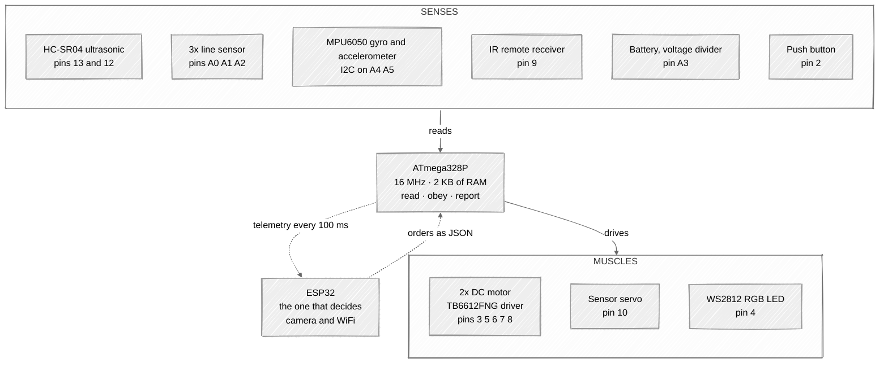
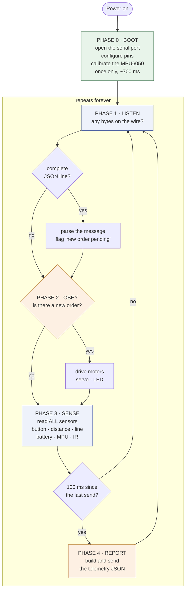

# ATmega328P Firmware — Elegoo Smart Car V4

[](https://opensource.org/licenses/MIT)
[](https://www.microchip.com/wwwproducts/en/ATmega328P)
[](https://platformio.org/)

Firmware for the car's **reflex brain**: it reads sensors, obeys orders, and reports what it sees. It decides nothing — the decisions are made by the ESP32 on the other end of the wire.

---

## How to read this README

Everything is explained **three times**, each time in more depth. Stop at the level you need and skip the rest.

| Level | Who it's for | What you get |
|---|---|---|
| **Level 1 — The idea** | You have never touched a microcontroller | Analogies. No code |
| **Level 2 — The mechanism** | You can program, hardware rings a bell | What actually happens, and why that way |
| **Level 3 — The code** | You are going to touch the firmware | Files, functions, lines. *Collapsed by default* |

**Contents**

- [Division of labour](#division-of-labour)
- [Inside the car](#inside-the-car)
- [The five phases](#the-five-phases) → [Phase 0](#phase-0--boot) · [Phase 1](#phase-1--listen) · [Phase 2](#phase-2--obey) · [Phase 3](#phase-3--sense) · [Phase 4](#phase-4--report)
- [Communication](#communication) ← *its own section; it is half the project*
- [Build and flash](#build-and-flash)
- [Gotchas](#gotchas)

---

## Division of labour

> ### Level 1 — The idea
>
> Think of the car as a person:
>
> | Part of the car | Human equivalent | Who handles it |
> |---|---|---|
> | Distance, line and battery sensors | The senses | **ATmega328P** — this repo |
> | Motors, servo, LED | Hands and legs | **ATmega328P** — this repo |
> | Moving the muscle *right now* | Reflexes, the spinal cord | **ATmega328P** — this repo |
> | "I am going to turn left" | The brain | **ESP32** or your PC |
> | What connects them | The spinal cord | A serial cable |
>
> The ATmega **never** decides to turn. Somebody orders it to. It obeys fast and reports what it sees.

> ### Level 2 — The mechanism
>
> This is a **two-microcontroller architecture**, and it exists for one concrete reason: **real time and raw compute are enemies**.
>
> The ATmega328P runs at 16 MHz with 2 KB of RAM. That is laughable next to the ESP32. But it is **predictable**: you know it will service the ultrasonic sensor on the exact millisecond it should, every time, because it has no operating system, no WiFi, and no TCP stack stealing cycles.
>
> The ESP32 has the horsepower to stream video over WiFi, but its network stack fires interrupts at unpredictable moments. Ask it to also run the ultrasonic `pulseIn` and sooner or later you get a garbage reading.
>
> **The split:** the slow, reliable chip touches the hardware. The fast, unpredictable chip thinks and talks to the world.

---

## Inside the car

Who is wired to what. Sensors on the left, the ATmega in the middle, muscles on the right, the boss on top.



<details>
<summary><b>Level 3 — The full pin map</b> (if you are about to solder, this is the truth)</summary>

All of it comes from [`include/elegoo_smart_car_lib.h`](include/elegoo_smart_car_lib.h). **One single file defines every pin** — if you rewire the car, you change it there and nowhere else.

| Pin | What is connected | Direction |
|---|---|---|
| 0 / 1 | UART RX/TX to the ESP32 | both |
| 2 | Push button, internal pull-up: pressed = `LOW` | input |
| 3 | Motor driver `STBY` — *shared by both motors* | output |
| 4 | WS2812 RGB LED | output |
| 5 | Right motor PWM, the speed | output |
| 6 | Left motor PWM, the speed | output |
| 7 | Right motor direction | output |
| 8 | Left motor direction | output |
| 9 | Infrared receiver | input |
| 10 | Servo that rotates the ultrasonic sensor | output |
| 12 | HC-SR04 `ECHO` | input |
| 13 | HC-SR04 `TRIG` | output |
| A0 / A1 / A2 | Line sensor right / middle / left | input |
| A3 | Battery voltage measurement | input |
| A4 / A5 | I2C to the MPU6050 | both |

</details>

---

## The five phases

> ### Level 1 — The idea
>
> A microcontroller never "finishes". It does one thing **once** at power-up (Phase 0) and then repeats the remaining four phases until you pull the battery. Hundreds of times per second.
>
> The cycle in one line: **listen → obey → look → report**.



> ### Level 2 — Why that order and no other
>
> The order is not accidental. It is the classic industrial-automation pattern: **read inputs → decide → write outputs**. It avoids the most common beginner mistake, which is acting on data from the previous iteration.
>
> - **Orders first** (Phases 1–2): if the boss says "stop", you want to stop *now*, not 25 ms from now.
> - **Sensors after** (Phase 3): the HC-SR04 can take up to 25 ms to answer. It is by far the slowest thing in the cycle.
> - **Sending last, and only every 100 ms** (Phase 4): serialising JSON and pushing it down the wire costs about 15 ms. Doing it every iteration would choke the loop.
>
> **The golden rule: nothing blocks.** No phase ever sits and waits. Firmware that calls `delay(100)` is firmware that is deaf for 100 ms.

<details>
<summary><b>Level 3 — The real loop</b></summary>

It all lives in [`src/main/main.cpp`](src/main/main.cpp). The whole `loop()` is five calls:

```cpp
void loop()
{
  readJsonBySerial();   // Phase 1 · ~5.6 ms
  checkTimeout();       // Phase 1 · watchdog
  processCommands();    // Phase 2 · ~4.3 ms
  readInput();          // Phase 3 · up to 25 ms because of the HC-SR04

  unsigned long currentTime = millis();          // Phase 4
  if (currentTime - lastSendTime >= SEND_INTERVAL)
  {
    sendJsonBySerial();
    lastSendTime = currentTime;
    swCount++;
  }
}
```

Note Phase 4: it **compares `millis()`, it does not call `delay()`**. That is the difference between a loop that keeps serving the rest of the world and one that goes blind.

</details>

---

### Phase 0 — Boot

> **Level 1** — When you plug the battery in, the car wakes up and gets ready: it opens the communication cable, decides which pin is an input and which is an output, and **sits still for half a second calibrating the motion sensor**. That half second matters: move the car while it boots and the gyro will be miscalibrated.

> **Level 2** — The sequence is: serial port at 115200 baud → configure pins (button with pull-up, LED strip, servo) → start ultrasonic, IR receiver and battery → start the I2C bus, initialise the MPU6050 and calibrate it.
>
> The waits are deliberate. The I2C bus needs to settle, and the MPU6050 needs time after `initialize()` before its readings mean anything. Total: roughly 750 ms from power-on to the first loop iteration.

<details>
<summary><b>Level 3 — setup()</b></summary>

```cpp
void setup()
{
  Serial.begin(115200);

  setupPins();          // button INPUT_PULLUP, FastLED.addLeds, servo.attach
  hcsr04.begin();
  irSensor.begin();
  delay(50);
  batterySensor.begin();

  Wire.begin();         // hardware I2C
  delay(100);           // let the bus settle
  mpu.initialize();
  delay(100);           // let the sensor settle
  mpuSensor.begin();    // calibration: averages N samples at rest

  delay(500);
}
```

Objects are instantiated **globally**, before `setup()`, using the pins from `elegoo_smart_car_lib.h`:

```cpp
Hcsr04 hcsr04(TRIG_PIN, ECHO_PIN);
MOTOR leftMotor(M_23_LEFT, LEFT_PWM, STBY);
MOTOR rightMotor(M_14_RIGHT, RIGHT_PWM, STBY);
ActuatorController actuatorController(leds, NUM_LEDS, servo, leftMotor, rightMotor);
```

No `new`, no heap. With 2 KB of RAM, anything that can be allocated at compile time is allocated at compile time.

</details>

---

### Phase 1 — Listen

> **Level 1** — The car checks whether anyone has spoken to it. Messages arrive **letter by letter**, not all at once, so it collects letters until it sees an end of line. If a message arrives split in half, it finishes receiving it on the next pass. It never stands around waiting.

> **Level 2** — This is **framing**: turning a shapeless stream of bytes into messages with a beginning and an end. The rule here is simple:
>
> - Everything is discarded until a `{` shows up — that starts a message.
> - Bytes accumulate until a `\n` shows up — that ends it.
> - If the buffer fills before the `\n`, everything is thrown away and it goes back to waiting for a `{`. That is **resynchronisation**: better to lose one corrupt message than to stay stuck forever.
>
> Only what is **already** in the serial buffer gets read (`Serial.available()`). Zero waiting.
>
> A watchdog runs alongside: if two seconds pass with nothing received, it raises a timeout flag. *Careful with that flag — see [Gotchas](#gotchas).*

<details>
<summary><b>Level 3 — readJsonBySerial() and checkTimeout()</b></summary>

A two-state machine (`inFrame` false/true) over a static buffer:

```cpp
char jsonBuffer[128];
size_t jsonBufferIndex = 0;
bool inFrame = false;

while (Serial.available() > 0)
{
  char c = Serial.read();

  if (!inFrame) {                    // waiting for start of frame
    if (c == '{') { inFrame = true; jsonBufferIndex = 0; jsonBuffer[jsonBufferIndex++] = c; }
    continue;                        // anything that is not '{' is dropped
  }

  if (c == '\n') {                   // end of frame: parse
    jsonBuffer[jsonBufferIndex] = '\0';
    inFrame = false;
    jsonDoc.clear();
    DeserializationError error = deserializeJson(jsonDoc, jsonBuffer);
    if (!error) { hasNewJson = true; lastReceiveTime = millis(); timeoutActive = false; }
    jsonBufferIndex = 0;
    continue;
  }

  if (c == '\r') continue;

  if (jsonBufferIndex < sizeof(jsonBuffer) - 1)
    jsonBuffer[jsonBufferIndex++] = c;
  else
    { jsonBufferIndex = 0; inFrame = false; }   // overflow -> resynchronise
}
```

Details that matter:

- `jsonBuffer` is a **static 128-byte array**. An Arduino `String` here would fragment the heap and hang the chip after a few hours.
- `StaticJsonDocument<256> jsonDoc` is **global and reused**, with `clear()` before each use. It serves both directions: receiving orders and building telemetry.
- Overflow does **not** truncate or half-parse. It discards and resynchronises.

</details>

---

### Phase 2 — Obey

> **Level 1** — If a new order arrived, it is carried out: drive the motors, rotate the servo, change the LED colour. If nothing arrived, the car **keeps doing whatever it was last told**. It does not stop on its own.

> **Level 2** — All the translation from "JSON text" to "movement" lives in **one single class**, `ActuatorController`. It is the only place in the firmware that touches an actuator. Neither `main.cpp` nor any other library writes to the motors directly.
>
> The three fields (`motors`, `servoAngle`, `ledColor`) are **optional and independent**: send only the one you want to change and the rest stay as they were.
>
> Two optimisations are visible in the hardware: the LED and the servo are **only written when the value actually changed**. Rewriting the same angle to a servo every 10 ms makes it buzz and heat up for nothing.

<details>
<summary><b>Level 3 — ActuatorController and MOTOR</b></summary>

[`lib/actuator_controller/`](lib/actuator_controller/) receives the already-parsed `JsonDocument` and dispatches:

```cpp
void ActuatorController::processCommands(const JsonDocument& receiveJson)
{
  if (receiveJson.containsKey("ledColor")) { /* only if it differs from previousLedColor */ }
  if (receiveJson.containsKey("servoAngle")) { processServo(receiveJson["servoAngle"]); }
  if (receiveJson.containsKey("motors")) {
    const char* motorAction = receiveJson["motors"]["action"];
    if (motorAction != nullptr)
      processMotors(motorAction, receiveJson["motors"]["speed"] | 0);   // joint mode
    else
      /* differential mode: motors.left / motors.right handled separately */;
  }
}
```

**Action strings are converted to an `enum` before the `switch`.** `parseMotorAction()` runs the `strcmp` calls once and returns `MotorAction::FORWARD` and friends. Without it you would chain six `strcmp` calls in every branch.

**Turning is pure differential drive**, no trigonometry:

```cpp
case MotorAction::TURN_LEFT:
  leftMotor.backward(speed);
  rightMotor.forward(speed);
  break;
```

**The speed mapping** in [`lib/motor/motor.cpp`](lib/motor/motor.cpp) hides a physical calibration:

```cpp
this->currentPwm = map(vel, 0, 100, MIN_PWM, MAX_PWM);   // MIN_PWM = 38, MAX_PWM = 255
```

The floor of 38 is not arbitrary: below that PWM the motor hums but cannot overcome its own friction. It is **the measured dead band of this specific motor**, and it is the number you will change if you swap motors or wheels.

</details>

---

### Phase 3 — Sense

> **Level 1** — The car reads all of its senses in one go and stores the values: whether the button is pressed, how far the obstacle is, whether it sees the black line, how much battery is left, whether it is being rotated, and whether you pressed a button on the remote.
>
> The car **does not react** to any of it. It just writes it down so it can report it in the next phase.

> **Level 2** — Every reading lands in a global variable that Phase 4 packages up. Three things that are not obvious:
>
> - **The ultrasonic sensor rate-limits itself.** Even if you call it every iteration, it only really measures once every 50 ms; the rest of the time it hands back the last value. Measuring faster produces false echoes from the previous ping.
> - **Decimals are converted to integers ×100.** A 7.40 V battery travels as `740`. See [Communication](#communication).
> - **The IR code is single-use.** It only updates when a new button arrives, and Phase 4 clears it after sending. The repeat frames the remote sends while you hold a button are filtered out and dropped.

<details>
<summary><b>Level 3 — readInput() and the sensor libraries</b></summary>

```cpp
void readInput()
{
  swPressed        = (!digitalRead(SWITCH_PIN));          // pull-up: LOW = pressed
  hcsr04DistanceCm = (uint8_t)hcsr04.getDistanceCm(validHcsr04);
  lineSensorLeft   = analogRead(LINE_LEFT_PIN);           // raw ADC 0..1023
  lineSensorMiddle = analogRead(LINE_MIDDLE_PIN);
  lineSensorRight  = analogRead(LINE_RIGHT_PIN);
  batVoltage       = (uint16_t)(batterySensor.getVoltage() * 100);

  mpuSensor.getMpuData();
  mpuAccelX = (int16_t)(mpuSensor.getValue(Mpu::ACCEL_X) * 100);
  /* ... remaining axes ... */

  uint32_t newIrRaw = irSensor.getIrRaw();
  if (newIrRaw != 0) irRaw = newIrRaw;    // 0 means "nothing new"
}
```

**[`lib/hcsr04/`](lib/hcsr04/) — the "measure with a brake" pattern:**

```cpp
if (now - lastScanTimeMs < 50) { valid = lastMeasurementValid; return lastDistanceCm; }
...
unsigned long duration = pulseIn(echoPin, HIGH, 25000UL);   // ~4 m timeout
if (duration == 0) { valid = false; return 0; }             // no echo = invalid reading
return (uint16_t)(duration / 58UL);                         // us -> cm
```

That `25000UL` is what stops a lost echo from hanging the loop. `pulseIn` without a timeout **blocks indefinitely** — the classic way for a robot to freeze the moment you point its sensor at the sky.

**[`lib/battery/`](lib/battery/) — from ADC counts to volts:**

```cpp
float voltage = analogValue * 5.0 / 1024.0 * (11.5 / 1.5);  // (R1+R2)/R2, voltage divider
voltage += voltage * tolerance;                             // ~8% measured compensation
```

The ATmega's ADC only reads 0 to 5 V, and the battery supplies 7.4 V. Hence the voltage divider on the board, and hence undoing that division in software. `tolerance` is **empirical calibration** against a multimeter: it is the number you tune if your reading disagrees with reality.

**[`lib/ir_sensor/`](lib/ir_sensor/) — repeat filtering:**

```cpp
if (IrReceiver.decodedIRData.flags & IRDATA_FLAGS_IS_REPEAT) { IrReceiver.resume(); return 0; }
```

The NEC protocol sends a dedicated "repeat" frame while you hold a button down. Dropping it here keeps one held button from reading as a hundred presses.

</details>

---

### Phase 4 — Report

> **Level 1** — Ten times a second, the car packs everything it has seen into a text message and sends it down the wire. That is its only report: whoever is on the other end sees the car **exclusively** through these messages.

> **Level 2** — It sends every 100 ms rather than every iteration because serialising and transmitting costs about 15 ms.
>
> There is an **implicit transaction** with the IR code: it is sent and then immediately zeroed, so a remote button shows up in exactly one message instead of the next ten. Side effect: if that message is lost, the button press is lost with it.

<details>
<summary><b>Level 3 — sendJsonBySerial()</b></summary>

```cpp
void sendJsonBySerial()
{
  jsonDoc.clear();                                  // the same document used in Phase 1

  jsonDoc["swPressed"]        = swPressed;
  jsonDoc["hcsr04DistanceCm"] = hcsr04DistanceCm;
  jsonDoc["irRaw"]            = irRaw;
  jsonDoc["batVoltage"]       = batVoltage;         // already scaled x100
  /* ... 14 fields in total ... */

  serializeJson(jsonDoc, Serial);                   // straight to the port, no intermediate buffer
  Serial.write('\n');                               // the frame delimiter

  irRaw = 0;                                        // consumed
}
```

`serializeJson(jsonDoc, Serial)` writes **character by character into the port**, never building the full string in RAM. A ~200-byte intermediate `String` would be 10% of the chip's entire RAM.

</details>

---

## Communication

This is the piece that makes the project debuggable. It deserves its own section.

> ### Level 1 — The idea
>
> The two chips talk over a cable, and they **talk in text you can read**. Not in secret binary codes: in text. Plug in the USB, open a serial monitor, and you literally see what they are saying to each other:
>
> ```
> {"swPressed":false,"hcsr04DistanceCm":37,"batVoltage":740,...}
> ```
>
> That is 90% of why debugging this project is not miserable.

> ### Level 2 — The mechanism
>
> **The channel:** UART, 115200 baud, two wires (RX and TX), full duplex — both sides can talk at once.
>
> **The format:** JSON, one message per line, terminated by `\n`. This is called **JSON Lines**, and it solves the hard problem in any serial protocol: knowing where one message ends and the next begins. Here, a newline.
>
> **Integers ×100 instead of decimals.** `7.4` as text is three characters and drags in the compiler's floating-point conversion (~2 KB of Flash on AVR). `740` is three characters and integer arithmetic. You divide by 100 on the other side. On a 32 KB chip that is 6% of Flash saved by a one-line decision.
>
> **What JSON costs:** it is slower and bulkier than a binary protocol. At 10 Hz with ~200-byte messages there is room to spare. If you ever push to 100 Hz, this is the first piece that will have to change.

### What the ATmega SENDS — every 100 ms

| Field | What it is | Example |
|---|---|---|
| `swPressed` | Button pressed right now | `true` |
| `swCount` | Counter of messages sent. Useful for spotting dropped messages | `1024` |
| `hcsr04DistanceCm` | Distance to the obstacle, in cm | `37` |
| `lineSensorLeft` / `Middle` / `Right` | Raw line-sensor reading, 0–1023 | `512` |
| `irRaw` | Raw code of the remote button. **Sent once, then cleared** | `3158310911` |
| `batVoltage` | Volts **×100** — `740` means 7.40 V | `740` |
| `mpuAccelX` / `Y` / `Z` | Acceleration **×100** | `-12` |
| `mpuGyroX` / `Y` / `Z` | Angular rate **×100** | `123` |

### What the ATmega RECEIVES

```json
{"motors":{"action":"forward","speed":60},"servoAngle":90,"ledColor":"GREEN"}
```

All three fields are **optional**. Send only the one you want to change.

**`motors.action`** — `forward`, `backward` (or `reverse`), `turnLeft`, `turnRight`, `forceStop`, `freeStop`.
Anything else is interpreted as `freeStop`.

**`motors.speed`** — 0 to 100.

**Differential mode**, each wheel separately — this is how you get smooth curves:

```json
{"motors":{"left":{"action":"forward","speed":80},"right":{"action":"forward","speed":40}}}
```

**`servoAngle`** — 0 to 200 degrees. Rotates the ultrasonic sensor.

**`ledColor`** — `RED`, `GREEN`, `BLUE`, `PURPLE`, `CYAN`, `YELLOW`, `SALMON`, `WHITE`, `BLACK`.

### `freeStop` vs `forceStop` — not the same thing

| | What the driver does | How it feels |
|---|---|---|
| `freeStop` | Cuts current and releases the motor | The car **coasts** to a halt |
| `forceStop` | Shorts the motor across itself | The car **brakes hard** |

<details>
<summary><b>Level 3 — Testing the protocol by hand, without an ESP32</b></summary>

You do not need the other chip at all. Plug in USB and type the messages yourself:

```bash
pio device monitor -b 115200
```

You will see the telemetry streaming. Now type a line and hit Enter:

```json
{"ledColor":"RED"}
{"motors":{"action":"forward","speed":50}}
{"motors":{"action":"forceStop","speed":0}}
```

From Python:

```python
import serial, json, time

s = serial.Serial('COM24', 115200, timeout=1)   # /dev/ttyUSB0 on Linux
time.sleep(2)                                    # the ATmega resets when the port opens

s.write(b'{"motors":{"action":"forward","speed":40}}\n')
time.sleep(1)
s.write(b'{"motors":{"action":"forceStop","speed":0}}\n')

for _ in range(10):
    line = s.readline().decode(errors='ignore').strip()
    if line.startswith('{'):
        print(json.loads(line))
```

That `if line.startswith('{')` is not decoration: the firmware also prints debug messages on the same port. See [Gotchas](#gotchas).

</details>

---

## Build and flash

You need [PlatformIO](https://platformio.org/) — the VS Code extension, or `pip install platformio`.

```bash
pio run -e atmega328_car              # build
pio run -e atmega328_car -t upload    # build and flash over USB
pio device monitor -b 115200          # watch the telemetry live
```

Two environments in [`platformio.ini`](platformio.ini):

- **`atmega328_car`** — the real firmware, `src/main/`. This is the default build.
- **`atmega328_test`** — the test bench, `src/test/`, with debug traces enabled.

<details>
<summary><b>Level 3 — The memory diet</b></summary>

The ATmega328P has **2 KB of RAM and 32 KB of Flash**. That is why `platformio.ini` is loaded with flags:

| Flag | What it saves |
|---|---|
| `-D DECODE_NEC` | Compiles only the IR protocol the remote uses, not the other ~15. **3–5 KB** |
| `-Os` | Optimise for size instead of speed |
| `-ffunction-sections -fdata-sections -Wl,--gc-sections` | The linker strips every function and datum nobody calls |
| `-fno-exceptions -fno-rtti` | Removes C++ machinery that is unused here |

And in the code: static buffers, a reused `StaticJsonDocument`, no `malloc`, no `String` on the hot path, constant text wrapped in `F()` so it lives in Flash rather than RAM.

Full detail in [`docs/RAM_OPTIMIZATION.md`](docs/RAM_OPTIMIZATION.md).

</details>

---

## Repository layout

```
src/main/main.cpp     <- the five-phase loop. If you read one file, read this one
include/              <- elegoo_smart_car_lib.h: EVERY pin lives here
lib/                  <- one folder per peripheral, each with its own README
docs/                 <- long-form docs and optimisation notes
course_notes/         <- course notes, by block and video
json/                 <- example messages
```

Libraries the firmware actually **uses**:

| Library | Responsibility | Phase |
|---|---|---|
| `actuator_controller` | Translates JSON into movement. The only thing that touches actuators | 2 |
| `motor` | One motor. `forward` / `backward` / `freeStop` / `forceStop` | 2 |
| `hcsr04` | Ultrasonic, with a 50 ms brake and an echo timeout | 3 |
| `ir_sensor` | Decodes NEC and filters repeats | 3 |
| `mpu` | MPU6050 accelerometer and gyro, calibrated at boot | 3 |
| `battery` | ADC counts to real volts | 3 |
| `led_rgb` | WS2812 LED via FastLED | 2 |

---

## Gotchas

Real quirks of this firmware. If something "doesn't work", look here before desoldering anything.

- **`speed: 0` does not stop the car.** 0–100 maps to PWM 38–255. To actually stop, use `forceStop` or `freeStop`.
- **`freeStop` on one wheel stops both.** The `STBY` pin (3) belongs to the whole driver, not to one channel. In differential mode, a `freeStop` on the left also kills the right.
- **The LED colour is decided by the first letter.** `processLed()` looks at `color[0]` and nothing else. So `WHITE` comes out grey (`W`) and `BANANA` comes out blue (`B`). It is fast and saves Flash, but worth knowing.
- **The 2-second timeout does nothing yet.** `checkTimeout()` detects that the ESP32 has been silent for two seconds and raises `timeoutActive`, which no code reads. **The car does not stop by itself if communication drops.** Hold onto it before testing.
- **Debug messages share the cable with the protocol.** `readJsonBySerial()` prints `>>> JSON recibido: ...` on the same `Serial` that carries the telemetry. Whoever is on the other end has to tolerate lines that are not JSON.
- **`irRaw` is sent exactly once.** It is zeroed after sending. If that message is lost, the remote press is lost: it never repeats.

---

## The rest of the project

| Repo | What it does |
|---|---|
| **firmware-atmega328p** — you are here | Sensors and actuators |
| [firmware-esp32-s3](https://github.com/Adc-alt/elegoo-smartcar-firmware-esp32-s3) | Camera, WiFi and the decisions |
| [elegoo-smartcar-vision](https://github.com/Adc-alt/elegoo-smartcar-vision) | Computer vision in Python |
| [hardware-smart-car](https://github.com/Adc-alt/hardware-smart-car) | PCBs and manufacturing |

Base hardware: [ELEGOO Smart Robot Car Kit V4.0](https://eu.elegoo.com/products/elegoo-smart-robot-car-kit-v-4-0).

## License

MIT.
