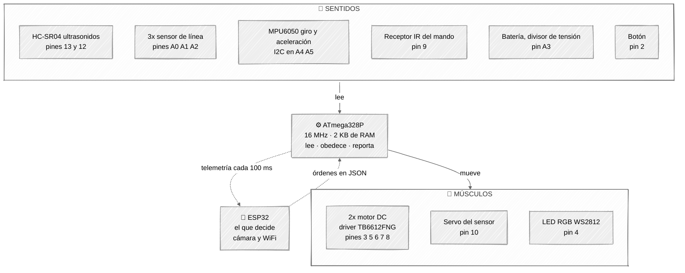
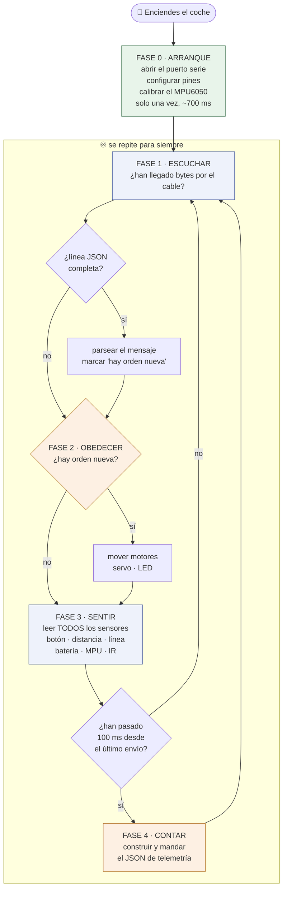

# 🚗 Firmware ATmega328P — Elegoo Smart Car V4

[](https://opensource.org/licenses/MIT)
[](https://www.microchip.com/wwwproducts/en/ATmega328P)
[](https://platformio.org/)

Firmware del **cerebro reflejo** del coche: lee sensores, obedece órdenes y reporta lo que ve. No decide nada — las decisiones las toma el ESP32 al otro lado del cable.

---

## 📖 Cómo leer este README

Todo está explicado **tres veces**, cada vez con más profundidad. Quédate en el nivel que necesites y salta el resto.

| | Nivel | Para quién | Qué encuentras |
|---|---|---|---|
| 🟢 | **Nivel 1 — La idea** | No has tocado un microcontrolador en tu vida | Analogías. Cero código |
| 🟡 | **Nivel 2 — El mecanismo** | Sabes programar, el hardware te suena | Qué pasa de verdad y por qué así |
| 🔴 | **Nivel 3 — El código** | Vas a tocar el firmware | Ficheros, funciones, líneas. *Plegado por defecto* |

**Índice**

- [El reparto de papeles](#-el-reparto-de-papeles)
- [El coche por dentro](#-el-coche-por-dentro-diagrama)
- [Las 5 fases del firmware](#-las-5-fases-del-firmware) → [Fase 0](#fase-0--arranque) · [Fase 1](#fase-1--escuchar) · [Fase 2](#fase-2--obedecer) · [Fase 3](#fase-3--sentir) · [Fase 4](#fase-4--contar)
- [La comunicación](#-la-comunicación) ← *sección propia, es media mitad del proyecto*
- [Compilar y flashear](#️-compilar-y-flashear)
- [Cosas que muerden](#️-cosas-que-muerden)

---

## 🎭 El reparto de papeles

> ### 🟢 Nivel 1 — La idea
>
> Imagina el coche como una persona:
>
> | Parte del coche | Equivalente humano | Quién lo hace |
> |---|---|---|
> | Sensores de distancia, línea, batería… | Los sentidos | **ATmega328P** ← este repo |
> | Motores, servo, LED | Las manos y las piernas | **ATmega328P** ← este repo |
> | Mover el músculo *ya* | Los reflejos, la médula | **ATmega328P** ← este repo |
> | "Voy a girar a la izquierda" | El cerebro | **ESP32** o tu PC |
> | Lo que los une | La médula espinal | Un cable serie |
>
> El ATmega **nunca** decide girar. Alguien se lo ordena. Él obedece rápido y cuenta lo que ve.

> ### 🟡 Nivel 2 — El mecanismo
>
> Esto se llama **arquitectura de dos micros**, y se hace así por una razón concreta: **el tiempo real y la potencia de cálculo son enemigos**.
>
> El ATmega328P corre a 16 MHz con 2 KB de RAM. Es ridículo comparado con el ESP32. Pero es **predecible**: sabes que va a atender el sensor de ultrasonidos en el milisegundo que toca, siempre, porque no tiene sistema operativo ni WiFi ni pila TCP robándole ciclos.
>
> El ESP32 tiene la potencia para hacer streaming de vídeo por WiFi, pero su stack de red genera interrupciones impredecibles. Si le pides que además haga el `pulseIn` del ultrasonidos, tarde o temprano te da una lectura basura.
>
> **Reparto:** el chip lento y fiable toca el hardware. El chip potente e impredecible piensa y habla con el mundo.

---

## 🎨 El coche por dentro (diagrama)

Quién está conectado a quién. Sensores a la izquierda, ATmega en el centro, músculos a la derecha, el jefe arriba.



<details>
<summary>🔴 <b>Nivel 3 — La tabla de pines completa</b> (si vas a soldar, esta es la verdad)</summary>

Todo sale de [`include/elegoo_smart_car_lib.h`](include/elegoo_smart_car_lib.h). **Un solo fichero define todos los pines** — si cambias el cableado, se cambia ahí y en ningún otro sitio.

| Pin | Qué hay conectado | Dirección |
|---|---|---|
| 0 / 1 | UART RX/TX hacia el ESP32 | ambas |
| 2 | Botón, con pull-up interno: pulsado = `LOW` | entrada |
| 3 | `STBY` del driver de motores ⚠️ *compartido por los dos* | salida |
| 4 | LED RGB WS2812 | salida |
| 5 | PWM motor derecho, la velocidad | salida |
| 6 | PWM motor izquierdo, la velocidad | salida |
| 7 | Dirección motor derecho | salida |
| 8 | Dirección motor izquierdo | salida |
| 9 | Receptor de infrarrojos | entrada |
| 10 | Servo que gira el sensor de ultrasonidos | salida |
| 12 | `ECHO` del HC-SR04 | entrada |
| 13 | `TRIG` del HC-SR04 | salida |
| A0 / A1 / A2 | Sensor de línea derecha / centro / izquierda | entrada |
| A3 | Medida de tensión de la batería | entrada |
| A4 / A5 | I2C hacia el MPU6050 | ambas |

</details>

---

## 🔄 Las 5 fases del firmware

> ### 🟢 Nivel 1 — La idea
>
> Un microcontrolador no "termina" nunca. Hace una cosa **una vez** al encenderse (la Fase 0) y después repite las cuatro fases restantes hasta que le quitas la batería. Cientos de veces por segundo.
>
> El ciclo, en una frase: **escucha → obedece → mira → cuenta**.



> ### 🟡 Nivel 2 — Por qué ese orden y no otro
>
> El orden no es casual. Es el patrón clásico de automatización industrial: **leer entradas → decidir → escribir salidas**. Evita el error más típico del principiante, que es actuar con datos de la vuelta anterior.
>
> - **Las órdenes primero** (Fases 1–2): si el jefe dice "para", quieres pararte *ya*, no dentro de 25 ms.
> - **Los sensores después** (Fase 3): el HC-SR04 puede tardar hasta 25 ms en contestar. Es de largo lo más lento del ciclo.
> - **El envío al final, y solo cada 100 ms** (Fase 4): serializar JSON y escupirlo por el cable cuesta unos 15 ms. Hacerlo en cada vuelta ahogaría el bucle.
>
> **La regla de oro: nada bloquea.** Ninguna fase se queda esperando. Un firmware que llama a `delay(100)` es un firmware sordo durante 100 ms.

<details>
<summary>🔴 <b>Nivel 3 — El bucle real</b></summary>

Todo vive en [`src/main/main.cpp`](src/main/main.cpp). El `loop()` entero son cinco llamadas:

```cpp
void loop()
{
  readJsonBySerial();   // Fase 1 · ~5.6 ms
  checkTimeout();       // Fase 1 · vigilancia
  processCommands();    // Fase 2 · ~4.3 ms
  readInput();          // Fase 3 · hasta 25 ms por el HC-SR04

  unsigned long currentTime = millis();          // Fase 4
  if (currentTime - lastSendTime >= SEND_INTERVAL)
  {
    sendJsonBySerial();
    lastSendTime = currentTime;
    swCount++;
  }
}
```

Fíjate en la Fase 4: **compara `millis()`, no llama a `delay()`**. Es la diferencia entre un bucle que sigue atendiendo el resto del mundo y uno que se queda ciego.

</details>

---

### Fase 0 · Arranque

> **🟢 Nivel 1** — Al enchufar la batería, el coche se despierta y se prepara: abre el cable de comunicación, decide qué pin es una entrada y cuál una salida, y **se queda quieto medio segundo calibrando el sensor de movimiento**. Ese medio segundo importa: si mueves el coche mientras arranca, el sensor de giro quedará mal calibrado.

> **🟡 Nivel 2** — La secuencia es: puerto serie a 115200 baudios → configurar pines (botón con pull-up, tira de LEDs, servo) → arrancar ultrasonidos, receptor IR y batería → arrancar el bus I2C, inicializar el MPU6050 y calibrarlo.
>
> Las esperas están puestas a propósito. El bus I2C necesita estabilizarse, y el MPU6050 necesita tiempo tras el `initialize()` antes de que sus lecturas valgan algo. Total: unos 750 ms desde que enchufas hasta la primera vuelta del bucle.

<details>
<summary>🔴 <b>Nivel 3 — setup()</b></summary>

```cpp
void setup()
{
  Serial.begin(115200);

  setupPins();          // botón INPUT_PULLUP, FastLED.addLeds, servo.attach
  hcsr04.begin();
  irSensor.begin();
  delay(50);
  batterySensor.begin();

  Wire.begin();         // I2C por hardware
  delay(100);           // que el bus se estabilice
  mpu.initialize();
  delay(100);           // que el sensor se estabilice
  mpuSensor.begin();    // calibración: promedia N muestras en reposo

  delay(500);
}
```

Los objetos se instancian **globalmente**, antes de `setup()`, con los pines de `elegoo_smart_car_lib.h`:

```cpp
Hcsr04 hcsr04(TRIG_PIN, ECHO_PIN);
MOTOR leftMotor(M_23_LEFT, LEFT_PWM, STBY);
MOTOR rightMotor(M_14_RIGHT, RIGHT_PWM, STBY);
ActuatorController actuatorController(leds, NUM_LEDS, servo, leftMotor, rightMotor);
```

Nada de `new`, nada de heap. En 2 KB de RAM, todo lo que se pueda reservar en tiempo de compilación se reserva en tiempo de compilación.

</details>

---

### Fase 1 · Escuchar

> **🟢 Nivel 1** — El coche mira si le han hablado. Los mensajes llegan **letra a letra**, no de golpe, así que va juntando letras hasta ver un final de línea. Si el mensaje viene partido, lo termina de recibir en la siguiente vuelta. Nunca se queda esperando plantado.

> **🟡 Nivel 2** — Esto es **framing**: convertir un chorro de bytes sin forma en mensajes con principio y fin. La regla aquí es simple:
>
> - Se ignora todo hasta ver una `{` → ahí empieza el mensaje.
> - Se acumulan bytes hasta ver un `\n` → ahí termina.
> - Si el buffer se llena antes del `\n`, se tira todo y se vuelve a esperar una `{`. Eso es **resincronización**: prefiere perder un mensaje corrupto a quedarse enganchado para siempre.
>
> Solo se lee lo que **ya está** en el buffer del puerto serie (`Serial.available()`). Cero espera.
>
> En paralelo hay un vigilante: si pasan 2 segundos sin recibir nada, levanta una bandera de timeout. ⚠️ *Ojo con esta bandera — ver [Cosas que muerden](#️-cosas-que-muerden)*.

<details>
<summary>🔴 <b>Nivel 3 — readJsonBySerial() y checkTimeout()</b></summary>

Máquina de estados de dos estados (`inFrame` false/true) sobre un buffer estático:

```cpp
char jsonBuffer[128];
size_t jsonBufferIndex = 0;
bool inFrame = false;

while (Serial.available() > 0)
{
  char c = Serial.read();

  if (!inFrame) {                    // esperando el inicio de trama
    if (c == '{') { inFrame = true; jsonBufferIndex = 0; jsonBuffer[jsonBufferIndex++] = c; }
    continue;                        // todo lo que no sea '{' se descarta
  }

  if (c == '\n') {                   // fin de trama: parsear
    jsonBuffer[jsonBufferIndex] = '\0';
    inFrame = false;
    jsonDoc.clear();
    DeserializationError error = deserializeJson(jsonDoc, jsonBuffer);
    if (!error) { hasNewJson = true; lastReceiveTime = millis(); timeoutActive = false; }
    jsonBufferIndex = 0;
    continue;
  }

  if (c == '\r') continue;

  if (jsonBufferIndex < sizeof(jsonBuffer) - 1)
    jsonBuffer[jsonBufferIndex++] = c;
  else
    { jsonBufferIndex = 0; inFrame = false; }   // overflow → resincronizar
}
```

Detalles que importan:

- `jsonBuffer` es **estático de 128 bytes**. Un `String` de Arduino aquí fragmentaría el heap y acabaría colgando el chip tras unas horas.
- `StaticJsonDocument<256> jsonDoc` es **global y reutilizado**, con `clear()` antes de cada uso. Se usa para las dos direcciones: recibir y construir telemetría.
- El overflow **no** trunca ni parsea a medias. Descarta y resincroniza.

</details>

---

### Fase 2 · Obedecer

> **🟢 Nivel 1** — Si ha llegado una orden nueva, se ejecuta: mover los motores, girar el servo, cambiar el color del LED. Si no ha llegado nada, el coche **sigue haciendo lo último que le dijeron**. No se para solo.

> **🟡 Nivel 2** — Toda la traducción de "texto JSON" a "movimiento" está en **una sola clase**, `ActuatorController`. Es el único sitio del firmware que toca un actuador. Ni `main.cpp` ni ninguna otra librería escriben directamente en los motores.
>
> Los tres campos (`motors`, `servoAngle`, `ledColor`) son **opcionales e independientes**: mandas solo el que quieras cambiar y los demás se quedan como estaban.
>
> Hay dos optimizaciones que se notan en el hardware: el LED y el servo **solo se escriben si el valor ha cambiado**. Reescribir el mismo ángulo en un servo cada 10 ms lo hace vibrar y calentarse para nada.

<details>
<summary>🔴 <b>Nivel 3 — ActuatorController y MOTOR</b></summary>

[`lib/actuator_controller/`](lib/actuator_controller/) recibe el `JsonDocument` ya parseado y despacha:

```cpp
void ActuatorController::processCommands(const JsonDocument& receiveJson)
{
  if (receiveJson.containsKey("ledColor")) { /* solo si cambió vs previousLedColor */ }
  if (receiveJson.containsKey("servoAngle")) { processServo(receiveJson["servoAngle"]); }
  if (receiveJson.containsKey("motors")) {
    const char* motorAction = receiveJson["motors"]["action"];
    if (motorAction != nullptr)
      processMotors(motorAction, receiveJson["motors"]["speed"] | 0);   // modo conjunto
    else
      /* modo diferencial: motors.left / motors.right por separado */;
  }
}
```

**Los strings de acción se convierten a un `enum` antes del `switch`.** `parseMotorAction()` hace los `strcmp` una sola vez y devuelve `MotorAction::FORWARD`, etc. Sin eso serían seis `strcmp` encadenados en cada rama.

**El giro es diferencial puro**, sin trigonometría:

```cpp
case MotorAction::TURN_LEFT:
  leftMotor.backward(speed);
  rightMotor.forward(speed);
  break;
```

**El mapeo de velocidad** en [`lib/motor/motor.cpp`](lib/motor/motor.cpp) esconde una calibración física:

```cpp
this->currentPwm = map(vel, 0, 100, MIN_PWM, MAX_PWM);   // MIN_PWM = 38, MAX_PWM = 255
```

El suelo de 38 no es arbitrario: por debajo de ese PWM el motor zumba pero no vence su propio rozamiento. Es **la zona muerta medida de este motor concreto**, y es el número que tocarás si cambias de motores o de ruedas.

</details>

---

### Fase 3 · Sentir

> **🟢 Nivel 1** — El coche lee todos sus sentidos de golpe y se guarda los valores: si está pulsado el botón, a qué distancia está el obstáculo, si ve la línea negra, cuánta batería le queda, si lo están girando, y si has pulsado un botón del mando a distancia.
>
> El coche **no reacciona** a nada de esto. Solo lo apunta para contarlo en la fase siguiente.

> **🟡 Nivel 2** — Todas las lecturas caen en variables globales que la Fase 4 empaqueta. Tres detalles que no son obvios:
>
> - **El ultrasonidos se autolimita.** Aunque lo llames cada vuelta, solo mide de verdad una vez cada 50 ms; el resto devuelve el último valor. Medir más rápido produce ecos falsos del disparo anterior.
> - **Los decimales se convierten a enteros ×100.** Batería 7,40 V viaja como `740`. Ver [La comunicación](#-la-comunicación).
> - **El código IR es de un solo uso.** Solo se actualiza cuando llega un botón nuevo, y la Fase 4 lo borra tras enviarlo. Las repeticiones que manda el mando al mantener pulsado se filtran y se descartan.

<details>
<summary>🔴 <b>Nivel 3 — readInput() y las librerías de sensores</b></summary>

```cpp
void readInput()
{
  swPressed        = (!digitalRead(SWITCH_PIN));          // pull-up: LOW = pulsado
  hcsr04DistanceCm = (uint8_t)hcsr04.getDistanceCm(validHcsr04);
  lineSensorLeft   = analogRead(LINE_LEFT_PIN);           // ADC crudo 0..1023
  lineSensorMiddle = analogRead(LINE_MIDDLE_PIN);
  lineSensorRight  = analogRead(LINE_RIGHT_PIN);
  batVoltage       = (uint16_t)(batterySensor.getVoltage() * 100);

  mpuSensor.getMpuData();
  mpuAccelX = (int16_t)(mpuSensor.getValue(Mpu::ACCEL_X) * 100);
  /* … resto de ejes … */

  uint32_t newIrRaw = irSensor.getIrRaw();
  if (newIrRaw != 0) irRaw = newIrRaw;    // 0 = "no hay nada nuevo"
}
```

**[`lib/hcsr04/`](lib/hcsr04/) — el patrón "medir con freno":**

```cpp
if (now - lastScanTimeMs < 50) { valid = lastMeasurementValid; return lastDistanceCm; }
...
unsigned long duration = pulseIn(echoPin, HIGH, 25000UL);   // timeout ~4 m
if (duration == 0) { valid = false; return 0; }             // sin eco = medición inválida
return (uint16_t)(duration / 58UL);                         // µs → cm
```

El `25000UL` es lo que impide que un eco perdido cuelgue el bucle. `pulseIn` sin timeout **bloquea indefinidamente** — es la forma clásica de que un coche se quede tieso al apuntar el sensor al cielo.

**[`lib/battery/`](lib/battery/) — de cuentas del ADC a voltios:**

```cpp
float voltage = analogValue * 5.0 / 1024.0 * (11.5 / 1.5);  // (R1+R2)/R2, divisor de tensión
voltage += voltage * tolerance;                             // ~8% de compensación medida
```

El ADC del ATmega solo lee de 0 a 5 V, y la batería da 7,4 V. Por eso hay un divisor de tensión en la placa, y por eso hay que deshacer la división en software. El `tolerance` es **calibración empírica** contra un multímetro: es el número que ajustas si tu lectura no cuadra con la realidad.

**[`lib/ir_sensor/`](lib/ir_sensor/) — filtrado de repeticiones:**

```cpp
if (IrReceiver.decodedIRData.flags & IRDATA_FLAGS_IS_REPEAT) { IrReceiver.resume(); return 0; }
```

El protocolo NEC manda una trama especial de "repetición" mientras mantienes el botón. Aquí se descarta para que un botón mantenido no se lea como cien pulsaciones.

</details>

---

### Fase 4 · Contar

> **🟢 Nivel 1** — Diez veces por segundo, el coche mete todo lo que ha visto en un mensaje de texto y lo manda por el cable. Es su único informe: quien esté al otro lado ve el coche **solo** a través de estos mensajes.

> **🟡 Nivel 2** — Se manda cada 100 ms, no en cada vuelta, porque serializar y transmitir cuesta ~15 ms.
>
> Hay una **transacción implícita** con el código IR: se envía y acto seguido se pone a cero, para que un botón del mando aparezca en un solo mensaje y no en los diez siguientes. Efecto secundario: si ese mensaje se pierde, la pulsación se perdió con él.

<details>
<summary>🔴 <b>Nivel 3 — sendJsonBySerial()</b></summary>

```cpp
void sendJsonBySerial()
{
  jsonDoc.clear();                                  // mismo documento que en la Fase 1

  jsonDoc["swPressed"]        = swPressed;
  jsonDoc["hcsr04DistanceCm"] = hcsr04DistanceCm;
  jsonDoc["irRaw"]            = irRaw;
  jsonDoc["batVoltage"]       = batVoltage;         // ya viene ×100
  /* … 14 campos en total … */

  serializeJson(jsonDoc, Serial);                   // directo al puerto, sin buffer intermedio
  Serial.write('\n');                               // el delimitador de trama

  irRaw = 0;                                        // consumido
}
```

`serializeJson(jsonDoc, Serial)` escribe **carácter a carácter en el puerto**, sin construir la cadena completa en RAM. Un `String` intermedio de ~200 bytes sería el 10% de la RAM total del chip.

</details>

---

## 📡 La comunicación

Esta es la pieza que hace que el proyecto sea depurable. Merece su propia sección.

> ### 🟢 Nivel 1 — La idea
>
> Los dos chips se hablan por un cable, y **hablan en texto que tú puedes leer**. No en códigos binarios secretos: en texto. Si enchufas el USB y abres un monitor serie, ves literalmente lo que se están diciendo:
>
> ```
> {"swPressed":false,"hcsr04DistanceCm":37,"batVoltage":740,...}
> ```
>
> Ese es el 90% de por qué depurar este proyecto no es un infierno.

> ### 🟡 Nivel 2 — El mecanismo
>
> **El canal:** UART, 115200 baudios, dos hilos (RX y TX), full-dúplex — ambos pueden hablar a la vez.
>
> **El formato:** JSON, un mensaje por línea, terminado en `\n`. Esto se llama **JSON Lines** y resuelve el problema difícil de cualquier protocolo serie: saber dónde acaba un mensaje y empieza el siguiente. Aquí, un salto de línea.
>
> **Los enteros ×100 en vez de decimales.** `7.4` como texto son 3 caracteres y obliga a arrastrar la conversión de coma flotante del compilador (~2 KB de Flash en AVR). `740` son 3 caracteres y aritmética entera. Divides por 100 al otro lado. En un chip de 32 KB, eso es un 6% del Flash ahorrado en una decisión de una línea.
>
> **El precio de JSON:** es más lento y ocupa más que un protocolo binario. A 10 Hz y con mensajes de ~200 bytes, sobra de largo. Si algún día subes a 100 Hz, esta es la primera pieza que habrá que cambiar.

### 📤 Lo que el ATmega ENVÍA — cada 100 ms

| Campo | Qué es | Ejemplo |
|---|---|---|
| `swPressed` | Botón pulsado ahora mismo | `true` |
| `swCount` | Contador de mensajes enviados. Sirve para detectar mensajes perdidos | `1024` |
| `hcsr04DistanceCm` | Distancia al obstáculo, en cm | `37` |
| `lineSensorLeft` / `Middle` / `Right` | Lectura cruda del sensor de línea, 0–1023 | `512` |
| `irRaw` | Código del botón del mando, en crudo. **Se manda una vez y se borra** | `3158310911` |
| `batVoltage` | Voltios **×100** — `740` es 7,40 V | `740` |
| `mpuAccelX` / `Y` / `Z` | Aceleración **×100** | `-12` |
| `mpuGyroX` / `Y` / `Z` | Velocidad angular **×100** | `123` |

### 📥 Lo que el ATmega RECIBE

```json
{"motors":{"action":"forward","speed":60},"servoAngle":90,"ledColor":"GREEN"}
```

Los tres campos son **opcionales**. Mandas solo el que quieras cambiar.

**`motors.action`** — `forward`, `backward` (o `reverse`), `turnLeft`, `turnRight`, `forceStop`, `freeStop`.
Cualquier otra cosa se interpreta como `freeStop`.

**`motors.speed`** — de 0 a 100.

**Modo diferencial**, cada rueda por separado — sirve para curvas suaves:

```json
{"motors":{"left":{"action":"forward","speed":80},"right":{"action":"forward","speed":40}}}
```

**`servoAngle`** — 0 a 200 grados. Gira el sensor de ultrasonidos.

**`ledColor`** — `RED`, `GREEN`, `BLUE`, `PURPLE`, `CYAN`, `YELLOW`, `SALMON`, `WHITE`, `BLACK`.

### 🛑 `freeStop` vs `forceStop` — no son lo mismo

| | Qué hace el driver | Cómo se siente |
|---|---|---|
| `freeStop` | Corta la corriente y suelta el motor | El coche **rueda** hasta pararse solo |
| `forceStop` | Cortocircuita el motor sobre sí mismo | El coche **frena en seco** |

<details>
<summary>🔴 <b>Nivel 3 — Probar el protocolo a mano, sin ESP32</b></summary>

No necesitas el otro micro para nada. Conecta el USB y escribe tú los mensajes:

```bash
pio device monitor -b 115200
```

Verás la telemetría fluyendo. Ahora escribe una línea y pulsa Enter:

```json
{"ledColor":"RED"}
{"motors":{"action":"forward","speed":50}}
{"motors":{"action":"forceStop","speed":0}}
```

Desde Python:

```python
import serial, json, time

s = serial.Serial('COM24', 115200, timeout=1)   # /dev/ttyUSB0 en Linux
time.sleep(2)                                    # el reset del ATmega al abrir el puerto

s.write(b'{"motors":{"action":"forward","speed":40}}\n')
time.sleep(1)
s.write(b'{"motors":{"action":"forceStop","speed":0}}\n')

for _ in range(10):
    linea = s.readline().decode(errors='ignore').strip()
    if linea.startswith('{'):
        print(json.loads(linea))
```

Ese `if linea.startswith('{')` no sobra: el firmware imprime también mensajes de debug por el mismo puerto. Ver [Cosas que muerden](#️-cosas-que-muerden).

</details>

---

## 🛠️ Compilar y flashear

Necesitas [PlatformIO](https://platformio.org/) — extensión de VS Code, o `pip install platformio`.

```bash
pio run -e atmega328_car              # compilar
pio run -e atmega328_car -t upload    # compilar y flashear por USB
pio device monitor -b 115200          # ver la telemetría en vivo
```

Dos entornos en [`platformio.ini`](platformio.ini):

- **`atmega328_car`** — el firmware de verdad, `src/main/`. Es el que se compila por defecto.
- **`atmega328_test`** — banco de pruebas, `src/test/`, con las trazas de debug activadas.

<details>
<summary>🔴 <b>Nivel 3 — La dieta de memoria</b></summary>

El ATmega328P tiene **2 KB de RAM y 32 KB de Flash**. Por eso el `platformio.ini` va cargado de flags:

| Flag | Qué ahorra |
|---|---|
| `-D DECODE_NEC` | Compila solo el protocolo IR del mando, no los ~15 restantes. **~3–5 KB** |
| `-Os` | Optimiza por tamaño en vez de por velocidad |
| `-ffunction-sections -fdata-sections -Wl,--gc-sections` | El linker elimina toda función y dato que nadie llama |
| `-fno-exceptions -fno-rtti` | Quita maquinaria de C++ que aquí no se usa |

Y en el código: buffers estáticos, `StaticJsonDocument` reutilizado, cero `malloc`, cero `String` en el camino caliente, texto constante con `F()` para que viva en Flash y no en RAM.

Detalle completo en [`docs/RAM_OPTIMIZATION.md`](docs/RAM_OPTIMIZATION.md).

</details>

---

## 📁 Qué hay en cada carpeta

```
src/main/main.cpp     ← el bucle de 5 fases. Si solo lees un fichero, lee este
include/              ← elegoo_smart_car_lib.h: TODOS los pines viven aquí
lib/                  ← una carpeta por periférico, cada una con su README
docs/                 ← documentación larga y notas de optimización
course_notes/         ← apuntes del curso, por bloques y vídeos
json/                 ← ejemplos de mensajes
```

Librerías que **usa** el firmware:

| Librería | Responsabilidad | Fase |
|---|---|---|
| `actuator_controller` | Traduce JSON a movimiento. El único que toca actuadores | 2 |
| `motor` | Un motor. `forward` / `backward` / `freeStop` / `forceStop` | 2 |
| `hcsr04` | Ultrasonidos, con freno de 50 ms y timeout de eco | 3 |
| `ir_sensor` | Decodifica NEC y filtra repeticiones | 3 |
| `mpu` | MPU6050: acelerómetro y giróscopo, calibrado al arrancar | 3 |
| `battery` | Cuentas del ADC → voltios reales | 3 |
| `led_rgb` | LED WS2812 vía FastLED | 2 |

---

## ⚠️ Cosas que muerden

Rarezas reales de este firmware. Si algo "no funciona", mira aquí antes de desoldar nada.

- **`speed: 0` no para el coche.** 0–100 se mapea a PWM 38–255. Para parar de verdad: `forceStop` o `freeStop`.
- **`freeStop` en una rueda para las dos.** El pin `STBY` (3) es del driver entero, no de un canal. En modo diferencial, un `freeStop` a la izquierda apaga también la derecha.
- **El color del LED se decide por la primera letra.** `processLed()` mira `color[0]` y nada más. Así que `WHITE` sale gris (`W`) y `BANANA` sale azul (`B`). Es rápido y ahorra Flash, pero conviene saberlo.
- **El timeout de 2 s todavía no hace nada.** `checkTimeout()` detecta que el ESP32 lleva 2 segundos callado y levanta `timeoutActive`… que ningún código lee. **El coche no se detiene solo si se corta la comunicación.** Sujétalo antes de probar.
- **Los mensajes de debug van por el mismo cable que el protocolo.** `readJsonBySerial()` imprime `>>> JSON recibido: …` en el mismo `Serial` que lleva la telemetría. Quien esté al otro lado tiene que tolerar líneas que no son JSON.
- **`irRaw` se manda una sola vez.** Tras enviarlo se pone a 0. Si ese mensaje se pierde, la pulsación del mando se perdió: no se repite.

---

## 🔗 El resto del proyecto

| Repo | Qué hace |
|---|---|
| **firmware-atmega328p** ← estás aquí | Sensores y actuadores |
| [firmware-esp32-s3](https://github.com/Adc-alt/elegoo-smartcar-firmware-esp32-s3) | Cámara, WiFi y las decisiones |
| [elegoo-smartcar-vision](https://github.com/Adc-alt/elegoo-smartcar-vision) | Visión por computador en Python |
| [hardware-smart-car](https://github.com/Adc-alt/hardware-smart-car) | PCBs y fabricación |

Hardware base: [ELEGOO Smart Robot Car Kit V4.0](https://eu.elegoo.com/products/elegoo-smart-robot-car-kit-v-4-0).

## 📄 Licencia

MIT.
